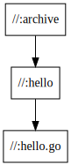

# bazel入門

この記事ではbazelを利用したGoアプリケーションのビルドを通して、bazelの用語や記法を学んでいきます。bazelコマンドが必要になりますので、[公式のドキュメント](https://docs.bazel.build/versions/master/install.html)を参照して事前にインストールを行ってください。

本記事では `3.7.2` を利用しています。

```console
$ bazel --version
bazel 3.7.2
```

## まず使ってみる

色々と説明を始める前にとりあえずbazelを使ってみましょう。

### アプリケーションの用意

ビルド対象となるGoのアプリケーションを用意します。これは実行すると `hello` と出力するだけのプログラムです。

```console
$ cat <<EOF > hello.go
package main

import "fmt"

func main() {
	fmt.Println("hello")
}
EOF
```

普通に実行してみると `hello` と出力されます。

```
$ go run hello.go
hello
```

### bazelで実行

では、今度はbazelで実行する環境を作っていきます。先ほど作成した `hello.go` と同じディレクトリに `WORKSPACE` というファイルを作成します。内容は以下の通りです。

```python
workspace(name = "myrepo")

load("@bazel_tools//tools/build_defs/repo:http.bzl", "http_archive")

http_archive(
    name = "io_bazel_rules_go",
    sha256 = "69de5c704a05ff37862f7e0f5534d4f479418afc21806c887db544a316f3cb6b",
    urls = [
        "https://mirror.bazel.build/github.com/bazelbuild/rules_go/releases/download/v0.27.0/rules_go-v0.27.0.tar.gz",
        "https://github.com/bazelbuild/rules_go/releases/download/v0.27.0/rules_go-v0.27.0.tar.gz",
    ],
)

load("@io_bazel_rules_go//go:deps.bzl", "go_register_toolchains", "go_rules_dependencies")

go_rules_dependencies()

go_register_toolchains(version = "1.16")
```

また、同じディレクトリに今度は `BUILD.bazel` というファイルを作成します。こちらの内容は以下の通りです。

```python
load("@io_bazel_rules_go//go:def.bzl", "go_binary")

go_binary(
    name = "hello",
    srcs = [":hello.go"],
)
```

2つのファイルが作成できたら実行してみましょう。以下のコマンドで行います。

```console
$ ls 
BUILD.bazel  WORKSPACE  hello.go

$ bazel run @myrepo//:hello
INFO: Analyzed target //:hello (0 packages loaded, 0 targets configured).
INFO: Found 1 target...
Target //:hello up-to-date:
  bazel-bin/hello_/hello
INFO: Elapsed time: 0.145s, Critical Path: 0.01s
INFO: 1 process: 1 internal.
INFO: Build completed successfully, 1 total action
INFO: Build completed successfully, 1 total action
hello
```

最終行に期待通り `hello` と出力されていますので、正しく実行できていることがわかります。なお、実行にあたって作成されたバイナリファイルは、INFOログに表示されている通り `./bazel-bin/hello_/hello` に保存されています。例では `bazel run` コマンドを使用しましたので、ビルド後に実行するところまでを一括で行っていますが、`bazel build` に置き換えればビルドのみを行います。

実行後、WORKSPACEファイルと同じ場所に `bazel-bin` のような `bazel-*` で始まるディレクトリがいくつか作成されています。これらのディレクトリにはbazelによって作成された成果物や、中間ファイル、ログなどが保存されています。`bazel clean` を実行すると全て削除できます。

```console
$ ls
BUILD.bazel  WORKSPACE  bazel-bin@  bazel-go@  bazel-out@  bazel-testlogs@  hello.go

$ bazel clean
INFO: Starting clean.

$ ls
BUILD.bazel  WORKSPACE  hello.go
```

一通り実行してみたところで、次は用語と記法の話に移りましょう

## 用語

### Workspace

サンプルのGoアプリケーションbazelのビルド環境を作成するにあたって、初めに `WORKSPACE` という名前のファイルを用意しました。このファイルの作成はbazelにおける `workspace` を宣言する行為であり、bazelの環境を構築する上で最初に行う作業となります。

WORKSPACEファイルの先頭に

```python
workspace(name = "myrepo")
```

とありましたが、これはworkspaceの参照時に使用する名前を定義しています。こうすることで、このworkspaceは `@myrepo//` という識別子で参照可能になります。なお、自身のworkspaceを参照する場合は `//` と省略することもできます。

bazelの用語としてのworkspaceとは、ビルドするソフトウェアのソースファイルを含む、ファイルシステム上のディレクトリを指します。WORKSPACEファイルが設置されたディレクトリは、workspaceのルートとして扱われるようになりますので、各リポジトリのルートディレクトリに作成されることが多いと思います。

### Starlark

[Starlark](https://github.com/bazelbuild/starlark)は、bazelの開発にあたって設計された言語で、WORKSPACEファイルやBUILDファイルの内容を記述する際に利用されます。StarlarkはPythonに似た記法を持ち、変数宣言や関数定義を行うことのできる動的型付け言語です。利用可能な変数等の宣言方法は[こちら](https://github.com/bazelbuild/starlark#tour)に例があります。

### Rule

[公式の説明](https://docs.bazel.build/versions/master/skylark/rules.html)を抜粋すると、ルールとは入力に対してbazelが実行するアクションを定義するもので、何らかの出力を伴うとあります。

Goのビルドの場合、入力とは `*.go` のようなソースファイルを指し、出力とは実行可能なバイナリファイルになるでしょう。このコンパイルのような作業を行うためのアクションが定義されたものがルールです。

ルールは自分で手元のworkspace内に定義することもできますし、公式やサードパーティが提供している外部のルールを利用することもできます。前述したサンプルではGoのビルドに必要なルールをまとめた [rules_go](https://github.com/bazelbuild/rules_go) を利用しましたが、dockerイメージを作成する [rules_docker](https://github.com/bazelbuild/rules_docker) や、tar, debファイルなどにアーカイブ化する [rules_pkg](https://github.com/bazelbuild/rules_pkg) などのように様々な言語や環境に対応するルールが存在します。

初めの例で使用した `rules_go` で定義されているルールの一覧は [README](https://github.com/bazelbuild/rules_go#documentation) に記載されています。BUILDファイルの中で使用した [go_binary](https://github.com/bazelbuild/rules_go/blob/master/go/core.rst#go_binary) は `*.go` ファイルを受け取り、実行可能なバイナリファイルを出力するルールでしたが、他にも [go_test](https://github.com/bazelbuild/rules_go/blob/master/go/core.rst#go_test) のように入力に `*_test.go` ファイルを受け取り、テスト結果を出力してくれるルールもあります。

### WORKSPACE file

WORKSPACEファイルの作成によって、bazelにおける `workspace` が定義されます。このファイルの内容は空でも問題ありませんが、大抵の場合はビルドに必要なbazelの外部ライブラリの入手方法を記述することになります。初めの例では、Goのアプリケーションをビルドするために必要な [rules_go](https://github.com/bazelbuild/rules_go) の入手方法を宣言していました。

```python
load("@bazel_tools//tools/build_defs/repo:http.bzl", "http_archive")

http_archive(
    name = "io_bazel_rules_go",
    sha256 = "69de5c704a05ff37862f7e0f5534d4f479418afc21806c887db544a316f3cb6b",
    urls = [
        "https://mirror.bazel.build/github.com/bazelbuild/rules_go/releases/download/v0.27.0/rules_go-v0.27.0.tar.gz",
        "https://github.com/bazelbuild/rules_go/releases/download/v0.27.0/rules_go-v0.27.0.tar.gz",
    ],
)

load("@io_bazel_rules_go//go:deps.bzl", "go_register_toolchains", "go_rules_dependencies")

go_rules_dependencies()

go_register_toolchains(version = "1.16")
```

一行目で呼び出されている `load` 文は、外部workspaceの `*.bzl` ファイルで定義されたシンボル(ルールや定数, 関数, 文字列, リストなど)を自身のworkspaceに読み込むために使用する、bazel標準のステートメントです。

このload文では `bazel_tools` というbazelに標準で組み込まれたworkspaceにある、`tools/build_defs/repo` ディレクトリの `http.bzl` ファイルを参照し、その中で定義された `http_archive` というルールを読み込んでいます。このルールの[実装](https://github.com/bazelbuild/bazel/blob/7044529/tools/build_defs/repo/http.bzl#L339)を見てみると、これもStarlarkで書かれていることがわかります。

次に、読み込んだ `http_archive` ルールを使用して、Goのビルドに必要なルール群を定義している [rules_go](https://github.com/bazelbuild/rules_go) を手元の環境にダウンロードしています。公開されているルール群を利用する際は、基本的にこの `http_archive` ルールを使って入手することになると思います。

なお、`http_archive` 以降の `go_rules_dependencies()` などについては、`rules_go` のルールを使用する上で必要な初期化処理です。実行が必要な処理はリポジトリによって異なりますので、READMEやリリースページに記載されている内容を参考にしてください。今回WORKSPACEファイルに記載した内容は `go_rules` の[リリースページ](https://github.com/bazelbuild/rules_go/releases/tag/v0.27.0)にある内容をそのまま使用しています。

また、loadステートメントについてより詳しく知りたい方は、[公式の説明](https://docs.bazel.build/versions/master/build-ref.html#load)を参照してください。

### BUILD file

WORKSPACEファイルは外部ライブラリの取得方法の定義に利用されました。一方でBUILDファイルは、bazelに対してビルド方法を指示するための設定ファイルです。どのソフトウェアをビルドするか、その依存関係は何か、どのようにビルドするかなどを記述します。bazelはBUILDファイルを参照してして依存関係のグラフを生成し、指定された出力を作成するために必要なアクションを導き出した上で、順番に実行していきます。

初めの例のBUILDファイルの内容は次の通りでした。

```python
load("@io_bazel_rules_go//go:def.bzl", "go_binary")

go_binary(
    name = "hello",
    srcs = [":hello.go"],
)
```

一行目ではload文を使用して、WORKSPACEファイルの中で入手した `io_bazel_rules_go (rules_go)` workspaceから `go_binary` ルールを読み込んでいます。その後、`go_binary` ルールから `hello` という名前のインスタンスを生成して、このルールが要求するソースファイルのパスなどの属性を指定しています。ルールのインスタンスを生成する際、`name` 属性の指定は必須ですが、その他の属性の多くはルールによって異なります。

### Package

初めの例では、BUILDファイルをWORKSPACEファイルと同じディレクトリに作成しましたが、BUILDファイルはworkspaceディレクトリの配下であればどこに作成しても構いませんし、以下のように複数のBUILDファイルを設置することもできます。 

```
./
├── WORKSPACE
└── cmd
    ├── bye
    │   ├── BUILD
    │   └── bye.go
    └── hello
        ├── BUILD
        └── hello.go
```

BUILDファイルが置かれたディレクトリは `package` と呼ばれ、workspaceルートからの相対パスを識別子に使用して参照可能です。上記のようなディレクトリ構成の場合、このworkspaceには `cmd/bye` と `cmd/hello` の2つのpackageが存在しています。

### Target

targetには `rule target`, `file target`, `package group` の3種類が存在します。この中でpackage groupについては利用頻度が少ないため今回は説明を省略し、残り2つに絞って解説します。

#### rule target

rule targetはBUILDファイル内で定義されたルールのインスタンスを指します。初めの例にも出てきましたが、以下の箇所がrule targetと呼ばれる箇所です。

```python
go_binary(
    name = "hello",
    srcs = [":hello.go"],
)
```

ルールのインスタンスを生成する際に指定された `name` 属性の値が、targetを参照する際の識別子に利用されます。このtargetを指定して `bazel run` や `bazel build` コマンドを実行することで、ルールで定義されたアクションが実施されます。rule targetは実装によりますが、テストやコンパイルなど何らかの形で実行が可能です。また、[ルール](#Rule)でも解説したように出力として成果物を伴います。

#### file target

WORKSPACEやBUILDファイルの中で何らかのファイルを参照する場合、それらは全て `file target` と呼ばれます。rule targetの説明の中で `go_binary` ルールの `srcs` 属性に `:hello.go` を指定していましたが、これもfile targetの一種です。

file targetは、ソースファイルのように開発者がリポジトリ内に直接作成したファイルの場合もありますし、rule targetが生成したファイルの場合もあります。

### Label

ラベルは単一のtargetを指し示す識別子で、これまでにも何度か登場しています。WORKSPACEファイルやBUILDファイル内でload文を書く際に、第一引数で参照するファイルを指定していましたが、これはfile targetを指し示すラベルです。

```python
load("@bazel_tools//tools/build_defs/repo:http.bzl", "http_archive")
```

また、BUILDファイル内でインスタンス化したrule targetを実行する際に、以下のコマンドを実行しました。このコマンドの引数に指定された `@myrepo//:hello` という文字列は実行対象のrule targetを指し示すラベルです。

```console
bazel run @myrepo//:hello
```

ラベルは、最大で `workspace`, `package`, `target` の3つの要素から構成されます。load文で使われたラベルを各要素に分解したものが以下の表です。

|要素|値|
|----|--|
|workspace|@bazel_tools//|
|package|tools/build_defs/repo|
|target|:http.bzl|

WORKSPACEファイルと同じディレクトリあるBUILDファイルのtargetを指定する際は、packageは省略されます。

自身のworkspace内のtargetを参照する際、workspace名は `//` に置き換えることができますので、次の2ラベルは同義です。

```console
bazel run @myrepo//:hello
bazel run //:hello
```

異なるworkspace, packageの参照は、必ず `workspace`, `package`, `target` の全てを利用した完全識別子で指定する必要がありますが、同一のBUILDファイル内で定義されたtargetを参照する場合は、target識別子のみで参照可能です。

```python
load("@io_bazel_rules_go//go:def.bzl", "go_binary")
load("@rules_pkg//:pkg.bzl", "pkg_tar")

go_binary(
    name = "hello",
    srcs = [":hello.go"],
)

pkg_tar(
    name = "archive",
    srcs = [":hello"],
    extension = "tar.gz",
    mode = "0755",
    package_dir = "usr/bin",
)
```

pkg_tarルールのfile属性に `:hello` が指定されています。こうすることで、同じBUILDファイル内にあるgo_binaryルールのインスタンスの出力を、pkg_tarルールの入力として利用するようになります。

## targetの依存関係

targetは何らかの形で依存関係を持っています。`bazel query` コマンドを利用してworkspace内の依存関係を可視化してみましょう。

初めに出てきたサンプルのWORKSPACEファイルとBUILDファイルを以下のように書き換えます。これは、Goのソースファイルをコンパイルした後、生成された実行可能ファイルをtarコマンドでアーカイブ化する例です。

### WORKSPACEファイル

```python
workspace(name = "myrepo")

load("@bazel_tools//tools/build_defs/repo:http.bzl", "http_archive")

http_archive(
    name = "io_bazel_rules_go",
    sha256 = "69de5c704a05ff37862f7e0f5534d4f479418afc21806c887db544a316f3cb6b",
    urls = [
        "https://mirror.bazel.build/github.com/bazelbuild/rules_go/releases/download/v0.27.0/rules_go-v0.27.0.tar.gz",
        "https://github.com/bazelbuild/rules_go/releases/download/v0.27.0/rules_go-v0.27.0.tar.gz",
    ],
)
load("@io_bazel_rules_go//go:deps.bzl", "go_register_toolchains", "go_rules_dependencies")
go_rules_dependencies()
go_register_toolchains(version = "1.16")

http_archive(
    name = "rules_pkg",
    urls = [
        "https://mirror.bazel.build/github.com/bazelbuild/rules_pkg/releases/download/0.4.0/rules_pkg-0.4.0.tar.gz",
        "https://github.com/bazelbuild/rules_pkg/releases/download/0.4.0/rules_pkg-0.4.0.tar.gz",
    ],
    sha256 = "038f1caa773a7e35b3663865ffb003169c6a71dc995e39bf4815792f385d837d",
)
load("@rules_pkg//:deps.bzl", "rules_pkg_dependencies")
rules_pkg_dependencies()
```

#### BUILDファイル

```python
load("@io_bazel_rules_go//go:def.bzl", "go_binary")
load("@rules_pkg//:pkg.bzl", "pkg_tar")

go_binary(
    name = "hello",
    srcs = [":hello.go"],
)

pkg_tar(
    name = "archive",
    srcs = [":hello"],
    extension = "tar.gz",
    mode = "0755",
    package_dir = "usr/bin",
)
```

このBUILDファイルでは、`:archive` というrule targetは、`:hello` というrule targetの出力に依存しています。また、`:hello` は `:hello.go` というfile targetに依存しています。

この `:archive` からの一連の依存関係を、以下のコマンドを実行してGraphvizのdot言語で出力してみましょう。

```console 
$ bazel query --nohost_deps --noimplicit_deps 'deps(//:archive)' --output graph
digraph mygraph {
  node [shape=box];
  "//:archive"
  "//:archive" -> "//:hello"
  "//:hello"
  "//:hello" -> "//:hello.go"
  "//:hello.go"
}
```

これを [GraphvizOnline](https://dreampuf.github.io/GraphvizOnline/) などで画像に変換したものがこちらになります。



今回のBUILDファイルは単純な構造ですのであまり面白みはありませんが、targetの依存関係が複雑になってきた際には役立つと思います。

## 外部ライブラリに依存するソフトウェアのビルド

